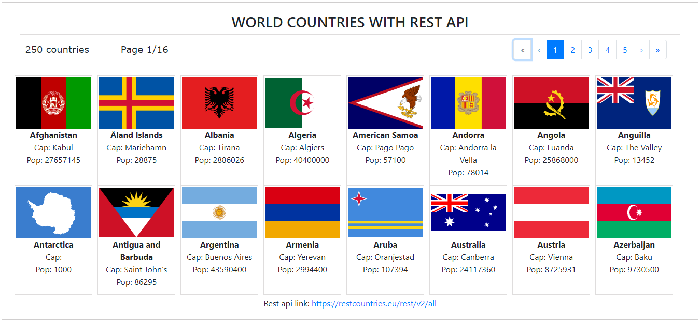

## World Countries with Reactstrap Pagination

This app was built with React v17.0.1

API for all country facts
[https://restcountries.eu/rest/v2/all](https://restcountries.eu/rest/v2/all)

## Deployment

This React App has been deployed to Heroku.

[Click here for Heroku](https://world-countries-react-app.herokuapp.com/#) to see the UI output in Heroku.

### OR

[Click here for Surge.sh](simplistic-person.surge.sh) to see the UI output in Surge.
